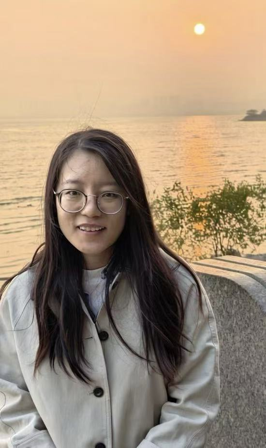

# Tongyao Pang · 庞彤瑶

**Assistant Professor**  
[Yau Mathematical Sciences Center](https://ymsc.tsinghua.edu.cn/en/info/1033/2765.htm), Tsinghua University

### Generative Models: Theory, Algorithms and Applications

I work on the mathematical foundations of generative models, with particular interests in sampling theory for generative models, model distillation, posterior training, and posterior sampling.

- **Theory:** approximation, estimation, convergence, and generalization
- **Algorithms:** diffusion, score-based, flow-based, reinforcement learning, and self-supervised models
- **Applications:** inverse problems, image restoration, visual representation, and scientific computation

 

## Selected publications

- **Self-supervised deep learning for inverse imaging problems** 
  H. Ji, T. Pang, and T. Zhang · *Machine Learning solutions for Inverse Problems, Part B*, Volume 27, Elsevier, October 2026 · [PDF](https://blog.nus.edu.sg/matjh/files/2026/05/handbook_2026.pdf)

- **Enhancing Low-resolution Image Representation Through Normalizing Flows**  
  Chenglong Bao, Tongyao Pang, Zuowei Shen, Dihan Zheng, Yihang Zou · arXiv, 2026 · [PDF](https://arxiv.org/pdf/2601.06834)

- **Outlier-Robust Diffusion Solvers for Inverse Problems**  
  Yang Zheng, Jiahua Liu, Tongyao Pang, Wen Li, Zhaoqiang Liu · CVPR, 2026 · [Paper](https://openaccess.thecvf.com/content/CVPR2026/papers/Zheng_Outlier-Robust_Diffusion_Solvers_for_Inverse_Problems_CVPR_2026_paper.pdf)

- **Siamese Cooperative Learning for Unsupervised Image Reconstruction from Incomplete Measurements**  
  Yuhui Quan, Xinran Qin, Tongyao Pang, Hui Ji · IEEE TPAMI, 2024 · [PDF](https://blog.nus.edu.sg/matjh/files/2024/02/TPAMI_2024_Siamese-2fc06b3e4d82da04.pdf) · [Code](https://github.com/XinranQin/SIAMNet)

- **Sparse Estimation: An MMSE Approach**  
  Tongyao Pang, Zuowei Shen · Constructive Approximation, 2023 · [PDF](https://blog.nus.edu.sg/matzuows/files/2022/01/MMSE_final.pdf)

- **Recorrupted-to-Recorrupted: Unsupervised Deep Learning for Image Denoising**  
  Tongyao Pang, Huan Zheng, Yuhui Quan, Hui Ji · CVPR, 2021 · [Paper](https://openaccess.thecvf.com/content/CVPR2021/html/Pang_Recorrupted-to-Recorrupted_Unsupervised_Deep_Learning_for_Image_Denoising_CVPR_2021_paper.html) · [Code](https://github.com/PangTongyao/Recorrupted-to-Recorrupted-Unsupervised-Deep-Learning-for-Image-Denoising)

- **Self-supervised Bayesian Deep Learning for Image Recovery with Applications to Compressive Sensing**  
  Tongyao Pang, Yuhui Quan, Hui Ji · ECCV, 2020 · [PDF](https://blog.nus.edu.sg/matjh/files/2020/07/ECCV_2020_BNNCS.pdf) · [Code](https://github.com/PangTongyao/Self-supervised-BNN-for-image-recovery)

## Experience & education

- **2024–present** · Assistant Professor, YMSC, Tsinghua University
- **2020–2023** · Postdoctoral Fellow, National University of Singapore
- **2014–2019** · Ph.D. in Mathematics, National University of Singapore
- **2010–2014** · Bachelor's in Mathematics, Peking University

## Teaching

- **Spring 2026** · Deep Learning Methods and Applications（深度学习方法和应用）
- **Fall 2025** · Deep Learning（深度学习）
- **Spring 2025** · Deep Learning Methods and Applications（深度学习方法和应用）
- **Fall 2024** · Introduction to Computer Vision（计算机视觉导论）
- **Spring 2024** · Deep Learning Methods and Applications（深度学习方法和应用）

## Links

[Academic homepage](https://pangtongyao.github.io/) · [Google Scholar](https://scholar.google.com/scholar?hl=en&q=%22Tongyao+Pang%22) · [DBLP](https://dblp.org/pid/263/6633.html) · [ORCID](https://orcid.org/0000-0002-1392-1242) · [YMSC](https://ymsc.tsinghua.edu.cn/en/info/1033/2765.htm)

📧 typang@tsinghua.edu.cn
